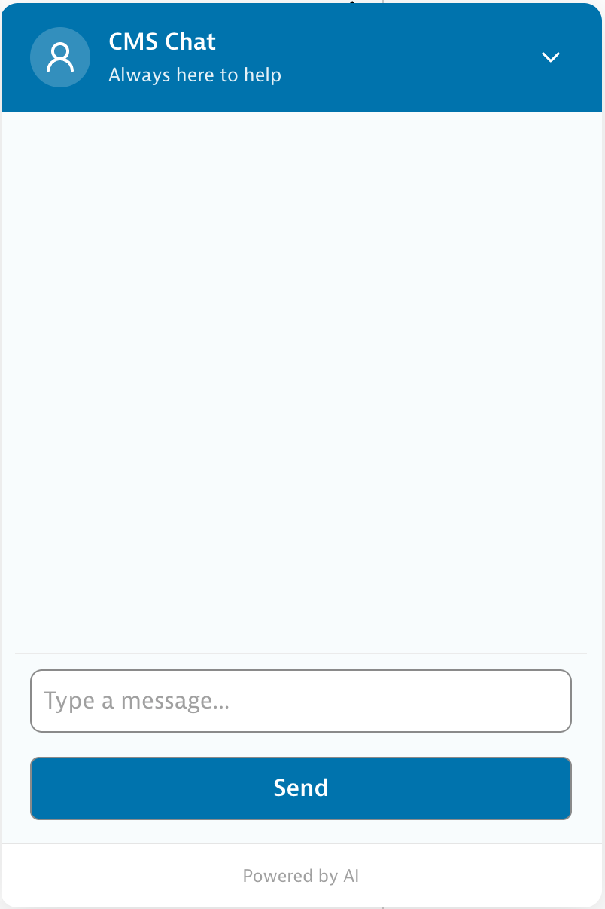
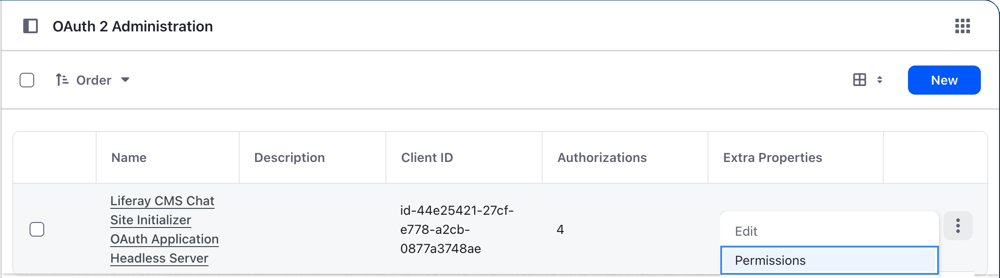

# Liferay CMS Chat

An AI-powered chat interface for Liferay DXP content. Ships as two Client Extensions:

- **`cmschat-site-initializer`** — Fragment that embeds the chat widget into Liferay pages and brokers calls to the microservice over OAuth2.
- **`cmschat-microservice`** — Spring Boot service that queries the Liferay Search API, extracts content from search results, and uses OpenAI to generate contextual responses with hyperlinked references back to the source content.



## Site Initializer Fragment

The `cmschat-site-initializer` Client Extension provisions a `CMS Chat` fragment under the company scope. Drop it onto any page to embed the chat widget; per-instance configuration is exposed through the Liferay fragment configuration UI:

| Field | Default | Purpose |
|---|---|---|
| `position` | `bottom-right` | Anchor corner for the floating launcher (`bottom-right` or `bottom-left`). |
| `chatWindowWidth` / `chatWindowHeight` | `400` / `600` | Chat window dimensions in pixels. |
| `openByDefault` | `false` | Whether the chat window starts expanded. |
| `userAgentERC` | `liferay-cmschatmicroservice-oauth-application-user-agent` | OAuth user-agent application ERC used to mint JWTs for the microservice. |
| `bypassSameOrigin` | `false` | Enable when the microservice runs on a different origin from the Liferay portal (any localhost-different-port dev setup, or a multi-host PaaS deployment). When enabled, the fragment extracts the OAuth2 access token via `_getOrRequestToken()` and routes the request through `Liferay.Util.fetch` instead of `OAuth2Client.fetch`, which otherwise refuses cross-origin requests at the JavaScript layer. Requires the microservice's `CORS_ALLOWED_ORIGIN_PATTERNS` to permit the portal's origin. |
| `blueprintERC` | *(empty)* | Search Blueprint ERC passed to the microservice on each request. |
| `protocol` / `hostname` / `port` | `https` / `localhost` / `443` | Where the fragment reaches the microservice — set these to the deployed microservice address. |

On submit, the fragment obtains an OAuth2 token via `@liferay/oauth2-provider-web/client`, then POSTs `{messages, roles, blueprintExternalReferenceCode, siteKey}` to `${protocol}://${hostname}:${port}/cmschat/completions`. The `siteKey` is the current site's numeric group ID, taken from `Liferay.ThemeDisplay.getScopeGroupId()` and used by `DisplayPageUrlService` to resolve Display Page URLs for Asset Library content.

The fragment also listens for a `cms-summarize` custom event (and an equivalent `?assetType=…&assetTitle=…` query string) that opens a modal and asks the microservice to summarize a specific asset — this is the path that triggers `SearchService`'s summarize mode.

### Grant Guest Access to the OAuth Application

For the fragment to obtain a JWT and call the microservice on behalf of unauthenticated visitors, the `Guest` role must be granted `VIEW` and `CREATE_TOKEN` permissions on the OAuth user-agent application that the site initializer provisions.

In **Control Panel → OAuth 2 Administration**, locate the `Liferay CMS Chat Site Initializer OAuth Application Headless Server` entry, open its action menu, and choose **Permissions**:



On the permissions screen, check `VIEW` and `CREATE_TOKEN` for the `Guest` role and save. Without these permissions, requests from anonymous users will fail to mint a token and the chat widget will not be able to reach the microservice.

## Microservice

### Environment Variables

| Variable | Required | Default | Description |
|---|---|---|---|
| `LIFERAY_BASE_URL` | **Yes** | `http://localhost:8080` | Base URL of the Liferay DXP instance, including protocol and port. Examples: `http://localhost:8080` (local dev), `https://webserver-myproject-prd.lfr.cloud` (LCP production). |
| `LIFERAY_ADMIN_EMAIL` | No | `test@liferay.com` | Admin email used to pre-warm Display Page URL caches at startup via basic auth. Optional — see note below. |
| `LIFERAY_ADMIN_PASSWORD` | No | `test` | Password for the admin user above. |
| `OPENAI_API_KEY` | **Yes** | `sk-PLACEHOLDER` | OpenAI API key for chat completions. Must be a valid key for the service to function. |
| `CORS_ALLOWED_ORIGIN_PATTERNS` | No | `*` | Comma-separated list of origin patterns the microservice will accept cross-origin requests from. Defaults to `*` (any origin) for local dev. Scope to a specific origin in production — e.g. `https://*.lfr.cloud` for an LCP deployment, or `https://portal.example.com` for a single-host setup. Required whenever the fragment's `bypassSameOrigin` is enabled. |

#### Example

```bash
export LIFERAY_BASE_URL=https://webserver-myproject-prd.lfr.cloud
export LIFERAY_ADMIN_EMAIL=test@liferay.com
export LIFERAY_ADMIN_PASSWORD=test
export OPENAI_API_KEY=sk-proj-abc123...
export CORS_ALLOWED_ORIGIN_PATTERNS=https://*.lfr.cloud
```

#### How They're Used

All variables are referenced in `application-default.properties` and cascade into derived properties:

```
LIFERAY_BASE_URL
├── liferay.base.url                          → base URL for URL resolution
├── liferay.headless.api.base.url             → ${liferay.base.url}/o
└── security.oauth2.resourceserver.jwk.jwk-set-uri → ${liferay.base.url}/o/oauth2/jwks

LIFERAY_ADMIN_EMAIL / LIFERAY_ADMIN_PASSWORD
├── liferay.admin.email                       → basic-auth email for startup API calls
└── liferay.admin.password                    → basic-auth password for startup API calls

OPENAI_API_KEY
└── openai.key                                → API key for OpenAI chat completions

CORS_ALLOWED_ORIGIN_PATTERNS
└── cors.allowed.origin.patterns              → consumed by CorsConfig to set
                                                allowed origin patterns for
                                                fragment cross-origin requests
```

> **Note on the admin credentials:** They are a **startup optimization, not a hard requirement**. `DisplayPageUrlService` uses them to pre-load its site, asset-library, and object-definition caches at boot via basic auth. If the credentials are absent, wrong, or the startup load fails for any other reason, each loader is retried on demand using the first incoming request's JWT — which has the required scopes by way of the OAuth user-agent application. The service still works without them; the only cost is that the first user request pays the cache-warming overhead.

### Endpoints & Runtime

- Listens on port **58081** (`server.port` in `application-default.properties`).
- **`POST /cmschat/completions`** — main chat endpoint. Accepts `messages`, `roles`, `blueprintExternalReferenceCode`, and `siteKey`; returns JSON `{"assistant": "<html>"}`. Requires a valid Liferay-issued JWT.
- **`GET /ready`** — unauthenticated liveness/readiness probe used by LCP (`LCP.json`); returns `READY`.

### Authentication

The microservice is a Spring Security OAuth2 resource server. It validates incoming JWTs against the Liferay JWKS endpoint (`${liferay.base.url}/o/oauth2/jwks`) and expects the OAuth user-agent application registered with external reference code `liferay-cmschatmicroservice-oauth-application-user-agent`. The OAuth scopes required by the service (declared in `client-extension.yaml`) are:

- `Liferay.Headless.Admin.Site.everything`
- `Liferay.Headless.Asset.Library.everything`
- `Liferay.Object.Admin.REST.everything`
- `Liferay.Portal.Search.REST.everything`
- `Liferay.Search.Experiences.REST.everything`

Startup-time API calls (loading sites, asset libraries, and object definitions) use HTTP basic auth with `LIFERAY_ADMIN_EMAIL` / `LIFERAY_ADMIN_PASSWORD`; request-time calls reuse the caller's JWT.

### Architecture

The service uses a **configuration-driven architecture** — adding support for a new Liferay content type that fits one of the existing extraction strategies (`HTML`, `DOCUMENT`, `CMS2_DOCUMENT`, `CONTENT_FIELDS`) requires only adding entries to `application-default.properties`. Introducing a *new* strategy requires registering an additional `StrategyHandler` in `SearchService.init()`.

#### Key Components

- **`SearchService`** — Queries the Liferay Search Blueprint API, classifies results using property-driven mappings, and extracts content via strategy handlers. Supports a "summarize the … titled X" phrase-search mode that narrows multi-result responses to a single best title match.
- **`DisplayPageUrlService`** — Dynamically resolves Display Page URLs by querying the Liferay site, asset library, and object-definition APIs. Handles custom Objects (`/o/c/`, `/o/cms/`), standard content types (`/o/headless-delivery/`), and Asset Library–scoped content. Results are cached for the lifetime of the application.
- **`PromptService`** — Builds OpenAI prompt parameters from search results, injecting per-result title, URL, focus-keyword, and content instructions.
- **`ChatController`** — REST endpoint (`/cmschat/completions`) that orchestrates search → prompt → completion, then converts the OpenAI Markdown response to HTML (with `target="_blank"` applied to links) before returning it to the fragment.

#### Adding a New Content Type

Append a new mapping block to `application-default.properties` using the next free index (existing entries occupy `[0]`–`[10]`):

```properties
cmschat.search.mappings[11].type=KNOWLEDGE_ARTICLE
cmschat.search.mappings[11].title=Knowledge Article
cmschat.search.mappings[11].match-field=articleTitle
cmschat.search.mappings[11].strategy=HTML
cmschat.search.mappings[11].text-field=articleBody
```

The Display Page URL is resolved automatically from the Liferay APIs — no URL configuration needed for content rendered by Liferay's standard Display Page infrastructure.
